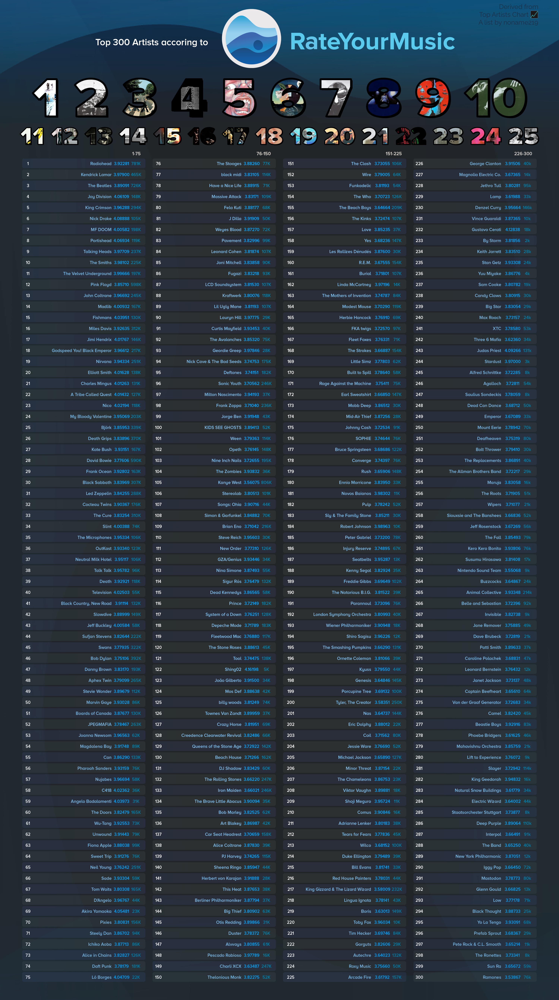
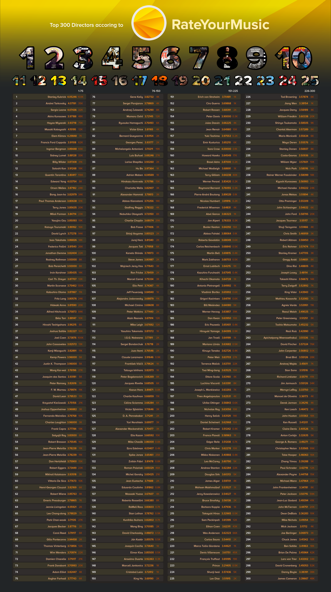
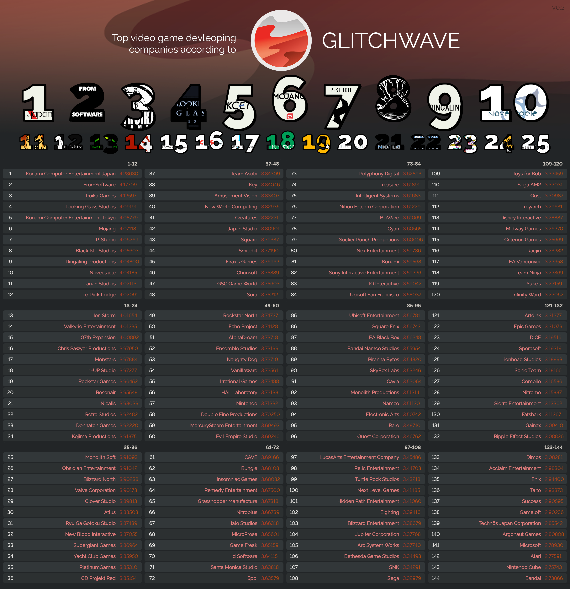
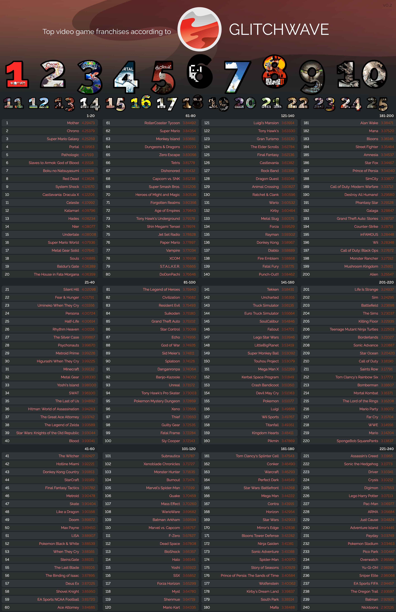

# RateYourMusic-Chart-Scraper
These are charts I have created by web scraping data off of a database called RateYourMusic. RateYourMusic is a website where thousands of users go to rate music and film. It's offshoot, Glitchave, is a database where users can rate video games. It is fairly similar to IMDb, but with, what I feel, is a far better search engine. The website itself has a [Top Albums Chart](https://rateyourmusic.com/charts/top/album/all-time/) and [Top Songs Chart](https://rateyourmusic.com/charts/top/song/all-time/), which have inspired users of the site to create a [Top Artists Chart](https://rateyourmusic.com/list/noname219/top-artists-chart-%F0%9F%93%88/). In turn, I was inspired as well to create my own version but for a Top Directors Chart (from the Film section of the database, a Top Video Game Franchise Chart, and a Top Video Game Development Company Chart.

I first scraped data from the sites on each Dirtector, Franchise, and Devlopment Company page. Then found the average rating across each release of the creatives/creative team's work. So for example, across the 32,790 ratings that Italian director Sergio Leone has recieved for the 7 works he has directed, he recieved an average of 4.07436 across all 32,790 ratings. This mehtod was sufficient for a short while, but I would soon find out that creatives/creative teams with small but loyal fan bases would rise to the top of the charts over larger more recognized creatives/creative teams. For example, the small franchise Boku no Natsuyasumi was above the likes of Grand Theft Auto, Persona, and Red Dead Redepmtion because its average score was significantly higher. This is when I felt it was necessary to implement a Bayesian Average to the mix to factor in popularity. While the three major franchises mentiioned earlier did have lower average scores than Boku no Natsuyasumi, they are siginificantly more well known and have larger fan bases which should be represented in the chart. The formula applied is shown below
